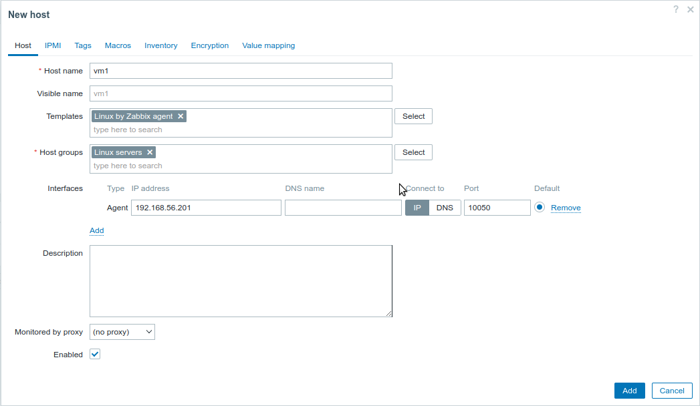
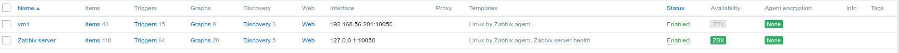
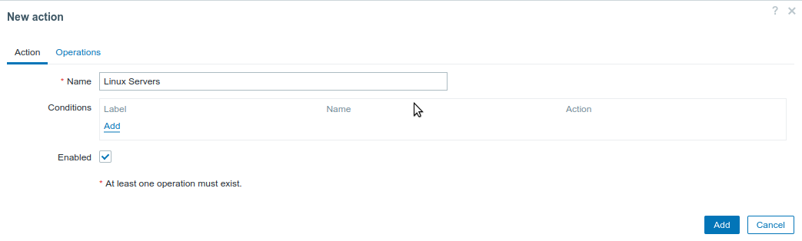
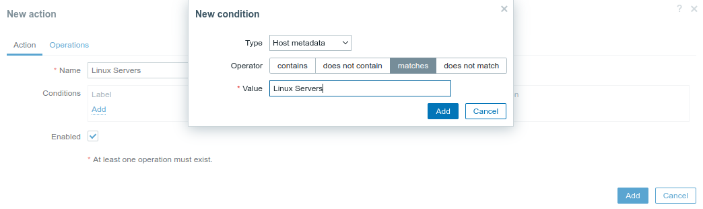
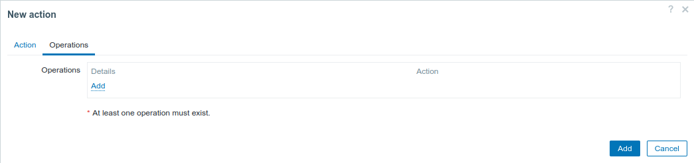
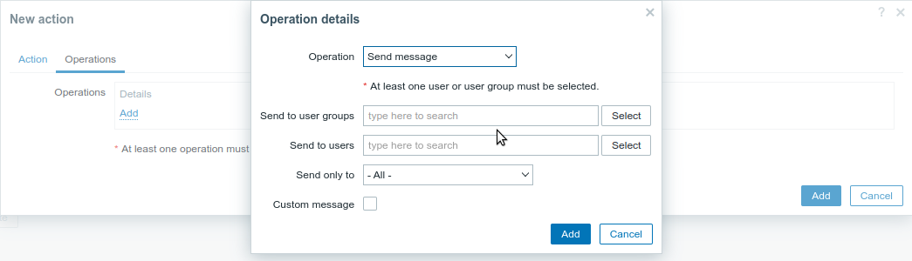
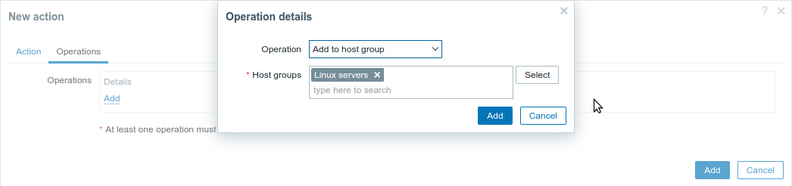
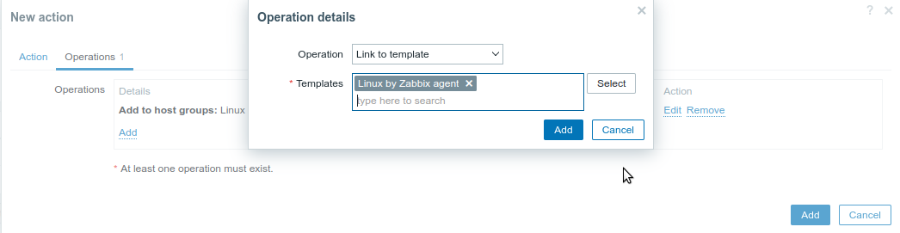

# **Taller de Monitoreo con Zabbix: Guía de Instalación**

¡Bienvenidos al emocionante mundo del monitoreo con Zabbix! 🚀 En esta guía, te acompañaremos paso a paso para configurar tu propio entorno de laboratorio y adentrarte en el fascinante universo del monitoreo. ¡No te preocupes si eres un novato en la materia, estamos aquí para que disfrutes de un proceso divertido y sencillo! 😄

## Índice

- [**Taller de Monitoreo con Zabbix: Guía de Instalación**](#taller-de-monitoreo-con-zabbix-guía-de-instalación)
  - [Índice](#índice)
  - [**Requisitos** 🛠️](#requisitos-️)
  - [**Preparativos** 🛠️](#preparativos-️)
      - [**1. Ansible**](#1-ansible)
      - [**2. VirtualBox**](#2-virtualbox)
      - [**3. Vagrant**](#3-vagrant)
      - [**4. Clonar el Repositorio**](#4-clonar-el-repositorio)
      - [**5. Generar una Clave SSH para Ansible**](#5-generar-una-clave-ssh-para-ansible)
      - [**6. Levantar las Máquinas Virtuales**](#6-levantar-las-máquinas-virtuales)
  - [**Direcciones IP de las Máquinas Virtuales**](#direcciones-ip-de-las-máquinas-virtuales)
  - [**Paso 1: Configuración del Zabbix Server**](#paso-1-configuración-del-zabbix-server)
  - [**Paso 3: Configuración del primer host VM1**](#paso-3-configuración-del-primer-host-vm1)
    - [Crear el host](#crear-el-host)
    - [Configurar el agente en el host VM1](#configurar-el-agente-en-el-host-vm1)
  - [**Paso 4: Instalación del Agente Zabbix en Windows VM (Opcional)**](#paso-4-instalación-del-agente-zabbix-en-windows-vm-opcional)
  - [**Paso 5: Configuración del Autoregistro de Zabbix**](#paso-5-configuración-del-autoregistro-de-zabbix)

¡Ahora sí, a disfrutar del contenido! 📚

## **Requisitos** 🛠️

Antes de comenzar, asegúrate de tener instalados los siguientes programas en tu máquina:

- [Ansible](https://www.ansible.com/)
- [VirtualBox](https://www.virtualbox.org/)
- [Vagrant](https://www.vagrantup.com/)

## **Preparativos** 🛠️

Antes de sumergirnos en la configuración, vamos a asegurarnos de que cuentas con las herramientas necesarias instaladas en tu computadora. No importa si eres nuevo en esto, ¡te acompañaremos en cada paso!

#### **1. Ansible**

Ansible es una herramienta que te permite automatizar tareas en múltiples servidores de manera sencilla. Lo utilizaremos para configurar los agentes de Zabbix en nuestras máquinas virtuales.

La instalación de Ansible es tan sencilla como seguir estos pasos:

1. Abre una terminal en tu sistema.
2. Según tu sistema operativo, ejecuta el siguiente comando para instalar Ansible:

   - En sistemas basados en Debian/Ubuntu:
     ```bash
     sudo apt update
     ```
     ```bash
     sudo apt install ansible
     ```

   - En sistemas basados en Red Hat/Fedora:
     ```bash
     sudo dnf install ansible
     ```

#### **2. VirtualBox**

VirtualBox es un software que te permite crear y gestionar máquinas virtuales en tu computadora. Usaremos VirtualBox para crear las máquinas virtuales donde configuraremos los agentes de Zabbix.

La instalación de VirtualBox es simple:

1. Visita el sitio web de [VirtualBox](https://www.virtualbox.org/) y descarga el instalador correspondiente a tu sistema operativo.
2. Ejecuta el instalador descargado y sigue las instrucciones en pantalla para completar la instalación.

#### **3. Vagrant**

Vagrant es una herramienta que facilita la creación y configuración de entornos de desarrollo reproducibles. Utilizaremos Vagrant para automatizar la creación de nuestras máquinas virtuales.

La instalación de Vagrant es sencilla:

1. Visita el sitio web de [Vagrant](https://www.vagrantup.com/) y descarga el instalador adecuado para tu sistema operativo.
2. Ejecuta el instalador descargado y sigue las instrucciones para finalizar la instalación.

#### **4. Clonar el Repositorio**
El repositorio del laboratorio contiene todos los archivos y configuraciones necesarios para llevar a cabo las tareas. Sigue estos pasos:

En tu sistema, abre una terminal.

Navega al directorio donde deseas almacenar el repositorio usando el comando `cd`. Por ejemplo:

```bash
cd ruta/de/tu/directorio
```

Clona el repositorio con el siguiente comando:

```bash
git clone https://github.com/lbrines/zabbix-nerdearla2023.git
```

Entra al repo clonado:

```bash
cd zabbix-nerdearla2023/
```

#### **5. Generar una Clave SSH para Ansible**

Ahora que cuentas con las herramientas instaladas, necesitamos generar una clave SSH que Ansible utilizará para conectarse de manera segura a los agentes de Zabbix en las máquinas virtuales. Sigue estos pasos:

1. Abre una terminal en tu sistema.

2. Navega al directorio donde planeas trabajar con Ansible. Por ejemplo:
   ```bash
   cd linux/ansible
   ```

3. Genera una nueva clave SSH con el siguiente comando. Esto creará un par de claves pública y privada:
   ```bash
   ssh-keygen -t rsa -b 4096 -f ansible_rsa
   ```

4. Durante la generación de la clave, se te solicitará ingresar una contraseña opcional. Puedes dejarlo en blanco para no establecer una contraseña.

¡Listo! Ahora tienes una clave SSH llamada `ansible_rsa` en el directorio `linux/ansible`, que Ansible utilizará para conectarse de manera segura a las máquinas virtuales y configurar los agentes de Zabbix.

#### **6. Levantar las Máquinas Virtuales**

Con el repositorio clonado, es hora de levantar las máquinas virtuales en las

 que configuraremos los agentes de Zabbix. Sigue estos pasos:

1. Abre una terminal.

2. Navega al directorio `linux` dentro del repositorio clonado:
   ```bash
   cd zabbix-nerdearla2023/linux
   ```

3. Ejecuta el siguiente comando para levantar las máquinas virtuales Linux:
   ```bash
   vagrant up
   ```

4. **Opcional:** Si también deseas explorar las máquinas virtuales Windows, accede al directorio `windows` dentro del repositorio clonado y ejecuta el mismo comando `vagrant up` para levantar las máquinas virtuales Windows.

¡Excelente! Ahora estás listo para comenzar a configurar los agentes de Zabbix en las máquinas virtuales que has levantado.

## **Direcciones IP de las Máquinas Virtuales**

Asegúrate de tomar nota de las siguientes direcciones IP para acceder a tus máquinas virtuales en el laboratorio:

- Zabbix Server: 192.168.56.200
- Windows VM: 192.168.56.220
- VM vm1: 192.168.56.201
- VM vm2: 192.168.56.202
- VM vm3: 192.168.56.203
- VM vm4: 192.168.56.204

## **Paso 1: Configuración del Zabbix Server**

1. Accede al Zabbix Server mediante el siguiente comando:

   ```bash 
   vagrant ssh zabbix-server 
   ```

2. Ejecuta los siguientes comandos uno a uno:

   ```bash
   wget https://repo.zabbix.com/zabbix/6.0/ubuntu/pool/main/z/zabbix-release/zabbix-release_6.0-4+ubuntu20.04_all.deb
   ```
   ```bash
   sudo dpkg -i zabbix-release_6.0-4+ubuntu20.04_all.deb
   ```
   ```bash
   sudo apt update
   ```

3. Instala Zabbix y MySQL Server:

   ```bash
   sudo apt install -y zabbix-server-mysql zabbix-frontend-php zabbix-apache-conf zabbix-sql-scripts zabbix-agent mysql-server
   ```

4. Configura la base de datos MySQL:

   ```bash
   sudo mysql -uroot -p
   ```
   ```bash
   create database zabbix character set utf8mb4 collate utf8mb4_bin;
   ```
   ```bash
   create user zabbix@localhost identified by 'password';
   ```
   ```bash
   grant all privileges on zabbix.* to zabbix@localhost;
   ```
   ```bash
   set global log_bin_trust_function_creators = 1;
   ```
   ```bash
   quit;
   ```

5. Instala la base de datos de Zabbix Server:

   ```bash
   sudo zcat /usr/share/zabbix-sql-scripts/mysql/server.sql.gz | mysql --default-character-set=utf8mb4 -uzabbix -p zabbix
   ```

6. Desactiva la creación de funciones:

   ```bash
   sudo mysql -uroot -p
   ```
   ```bash
   set global log_bin_trust_function_creators = 0;
   ```
   ```bash
   quit;
   ```

7. Edita el archivo de configuración del Zabbix Server:

   ```bash
   sudo vim /etc/zabbix/zabbix_server.conf
   ```

8. Agrega la siguiente línea y guarda el archivo:

   ```conf
   DBPassword=password
   ```

9. Reinicia los servicios:

   ```bash
   sudo systemctl restart zabbix-server zabbix-agent apache2
   sudo systemctl enable zabbix-server zabbix-agent apache2
   ```

10. Accede a Zabbix en tu navegador utilizando: [http://192.168.56.200/zabbix/](http://192.168.56.200/zabbix/)

11. ¡Listo! Sigue los pasos en pantalla para configurar la contraseña de la base de datos, la región y la zona horaria.

12. Ingresa con las siguientes credenciales:
    - Usuario: Admin
    - Contraseña: zabbix
    - Accede a [http://192.168.56.200/zabbix/](http://192.168.56.200/zabbix/)

## **Paso 3: Configuración del primer host VM1**

### Crear el host
1. Accede al menú principal a `Data Collection/Hosts`.
2. Haz clic en el botón "Create host".
3. Completa los datos básicos del formulario.
   
   Este sería el resultado esperado:
   

### Configurar el agente en el host VM1
4. En tu directorio `zabbix-nerdearla2023/linux`, ejecuta:

   ```bash
   vagrant ssh vm1
   ```

5. Ejecuta los siguientes comandos uno por uno:

   ```bash
   wget https://repo.zabbix.com/zabbix/6.0/ubuntu/pool/main/z/zabbix-release/zabbix-release_6.0-4+ubuntu20.04_all.deb
   ```
   ```bash
   sudo dpkg -i zabbix-release_6.0-4+ubuntu20.04_all.deb
   ```
   ```bash
   sudo apt update
   ```

6. Instala el agente de Zabbix y edita su archivo de configuración:

   ```bash
   sudo apt install -y zabbix-agent
   ```
   ```bash
   sudo vim /etc/zabbix/zabbix_agentd.conf
   ```

7. Agrega la siguiente línea (reemplaza `192.168.56.200` con la dirección IP del Zabbix Server) y guarda el archivo:

   ```conf
   Server=192.168.56.200
   ```

8. Reinicia el servicio:
   ```bash
   sudo systemctl restart zabbix-agent.service
   ```

9. Opcional pero emocionante: instala la herramienta de estrés para simular consumo de memoria:

   ```bash
   sudo apt-get install stressapptest
   ```

10. Ejecuta la herramienta de estrés:

   ```bash
   stressapptest -s 3600
   ```

11. ¡Voilà! ¡Has completado la configuración del agente de Zabbix en `vm1`!

## **Paso 4: Instalación del Agente Zabbix en Windows VM (Opcional)**

1. Accede por RDP a la máquina virtual de Windows con la dirección IP `192.168.56.220`.

2. Instala `zabbix_agent-6.0.20-windows-amd64-openssl.msi` que se encuentra en `C:/vagrant`.

3. Cuando lo solicite, coloca la dirección IP del Zabbix Server `192.168.56.200`.

4. Agrega el

 host siguiendo los mismos pasos del Paso 3, pero utiliza el template llamado "Zabbix Agent Windows".

## **Paso 5: Configuración del Autoregistro de Zabbix**

1. Entra en el menú principal a `Alerts/Actions/Autoregistration actions`.
2. Haz clic en el botón "Create action".
3. Completa los datos básicos del formulario.
   
   Coloca el nombre de la nueva acción y luego haz clic en "Add".

   
   ```conf
   Tipo: Host metadata
   Coincide con: Linux Servers
   ```
   
   ```conf
   Haz clic en "Add".
   ```
   
   Selecciona la operación deseada.

   
   ```conf
   Selecciona "Add to host group" y busca "Linux server".
   ```
   
   ```conf
   Selecciona "Link to template" y busca "Linux by Zabbix agent".
   Al finalizar, haz clic en el botón "Add".
   ```

   ¡Listo! Ahora tienes el Zabbix Server listo para recibir datos de autoregistro.

4. Entra al directorio `linux/ansible` y ejecuta:

   ```bash
   ansible-playbook config-agent.yml
   ```

5. En el frontend de Zabbix, ve a Configuración → Acciones, selecciona "Autoregistro" como fuente de eventos y haz clic en "Crear acción".

6. En la pestaña "Acción", ponle un nombre a tu acción.

7. Opcionalmente, especifica condiciones. Puedes hacer coincidir subcadenas o usar expresiones regulares en las condiciones para el nombre del host/metadatos del host. Si vas a usar la condición "Metadatos del host", consulta la siguiente sección.

8. En la pestaña "Operaciones", agrega operaciones relevantes, como "Agregar host", "Agregar a grupo de hosts" (por ejemplo, hosts descubiertos), "Vincular a plantillas", etc.

¡Y eso es todo, maestro! 🎉 Ahora tienes un entorno de laboratorio configurado con Zabbix para comenzar tu emocionante viaje en el mundo del monitoreo. ¡Diviértete explorando, modificando y aprendiendo! 😃📊🔍